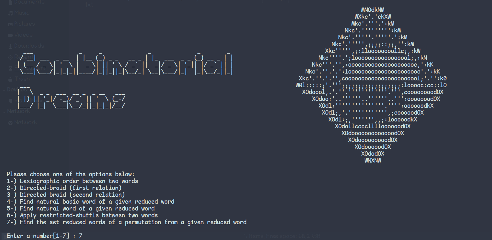

# reduced-word-combinatorics

## Description and Basic Terminology

This is a terminal based program to do various comparisions on permutations (defined on symmetric groups) and also to find the set of all reduced word representing a permutation.

If what you read sound chinese to you, consider taking a look at the following articles:

1. [O. Coşkun, M. Taşkın, Sorting and generating reduced words, Arch. Math. 101 (2013), 427-436](http://dx.doi.org/10.1007/s00013-013-0571-7)

2. [R. Stanley, On the number of reduced decompositions of elements of Coxeter groups, European J. Combinatorics, 5 (1984)](https://math.mit.edu/~rstan/pubs/pubfiles/56.pdf)

3. [A. Garsia, The saga of reduced factorizations of elements of the symmetric group](https://www.semanticscholar.org/paper/The-Saga-of-Reduced-Factorizations-of-Elements-of-Garsia/70ca398687634c4646921e28429728877f67a8a8)

## Requirements

You need a [terminal emulator](https://en.wikipedia.org/wiki/Terminal_emulator) of your choice and any [C/C++ compiler](https://en.wikibooks.org/wiki/C%2B%2B_Programming/Compiler/Where_to_get). Compile directly from source code, and then run the executable output.

If you are using the `GNU Project Compiler` in Linux: `g++ reduced-word.cpp -o output_name` , then `./output_name`.

## License

Copyright (c) 2022 cutiness

This program is free software: you can redistribute it and/or modify
it under the terms of the GNU General Public License as published by
the Free Software Foundation, either version 3 of the License, or
(at your option) any later version.

This program is distributed in the hope that it will be useful,
but WITHOUT ANY WARRANTY; without even the implied warranty of
MERCHANTABILITY or FITNESS FOR A PARTICULAR PURPOSE.  See the
GNU General Public License for more details.

You should have received a copy of the GNU General Public License
along with this program.  If not, see <http://www.gnu.org/licenses/>.
