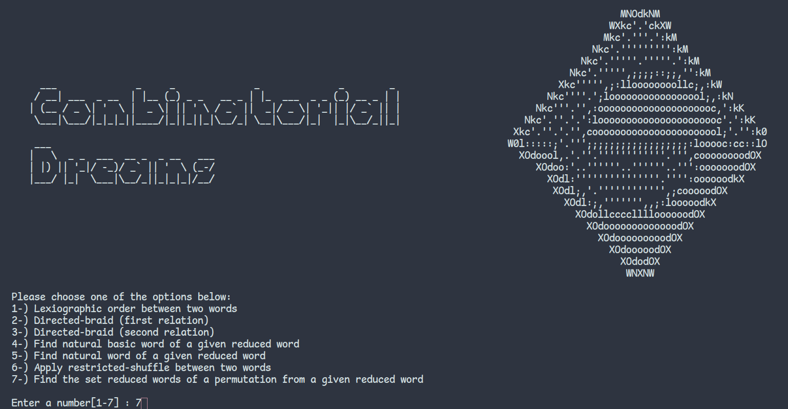

# reduced-word-combinatorics

## Description and Basic Terminology

This is a terminal based program to do various comparisions on permutations (defined on symmetric groups) and also to find the set of all reduced word representing a permutation. A word is basically a notation for transpositions, and we try to find the list of all words that do this with least elements possible.

If what you read sound chinese to you, consider taking a look at the following articles:

1. [O. Coşkun, M. Taşkın, Sorting and generating reduced words, Arch. Math. 101 (2013), 427-436](http://dx.doi.org/10.1007/s00013-013-0571-7)

2. [R. Stanley, On the number of reduced decompositions of elements of Coxeter groups, European J. Combinatorics, 5 (1984)](https://math.mit.edu/~rstan/pubs/pubfiles/56.pdf)

3. [A. Garsia, The saga of reduced factorizations of elements of the symmetric group](https://www.semanticscholar.org/paper/The-Saga-of-Reduced-Factorizations-of-Elements-of-Garsia/70ca398687634c4646921e28429728877f67a8a8)

4. [O. Coşkun, M. Taşkın ,“Tower tableaux”, Journal of Combinatorial Theory Series A, 120, 4, 843-871, 2013.](https://www.researchgate.net/publication/230795137_Tower_Tableaux)

## Requirements

You need a [terminal emulator](https://en.wikipedia.org/wiki/Terminal_emulator) of your choice and any [C/C++ compiler](https://en.wikibooks.org/wiki/C%2B%2B_Programming/Compiler/Where_to_get). Compile directly from source code, and then run the executable output.

Preferrably, you need to have the `make` utility installed on your system. In `MacOS or Linux` you may compile everything with `make all`, there is no need for root privileges. 

By default the `Makefile` uses `GNU Project Compiler` if you are using something else, what you need to do is, create object files for `tower-diagram.cpp` and `functions.cpp`. After that you need to compile the driver code `reduced-word.cpp` together with those two helpers. With `gcc` it would look like the following:

`g++ tower-digram.cpp` (by default the ouput file name is tower-diagram.o)

`g++ functions.cpp` (by default the output file name is functions.o)

`g++ reduced-word.cpp tower-diagram.o functions.o -o output_name`

`./output_name`

There is already a `Makefile` to automate this process, but if you are on `Windows` and using `MinGW` or a derivative, you may need to do it manually. Many IDE's also have support for `Makefile` file structure, so you may also use them.

After compiling, you may clean all the outputs with `make clean`, and acsess the program by coming to the directory you compiled and writing `./output_name`.

## License

Copyright (c) 2022 cutiness

This program is free software: you can redistribute it and/or modify
it under the terms of the GNU General Public License as published by
the Free Software Foundation, either version 3 of the License, or
(at your option) any later version.

This program is distributed in the hope that it will be useful,
but WITHOUT ANY WARRANTY; without even the implied warranty of
MERCHANTABILITY or FITNESS FOR A PARTICULAR PURPOSE.  See the
GNU General Public License for more details.

You should have received a copy of the GNU General Public License
along with this program.  If not, see <http://www.gnu.org/licenses/>.
